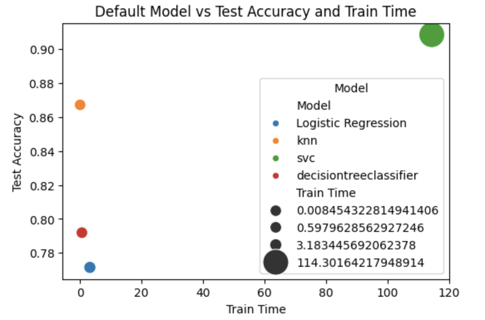

## Assignment 17.1: Compare the performance of the classifiers realted to marketing bank products over the telephone.

### **Goal**

The business goal of the Portuguese bank is to increase marketing campaign efficincy by identifying the parameters that leads to winning customers for subscribing the deposit. i.e the reduction in marketing cost and time whereas maintaining the deposit subscription numbers.

 The ML model goal is to predict if the customer will subscribe a term deposit or not.

### **Approach**

CRISP-DM Data Science lifecycle approach is applied. This process provides a framework for working through a data problem. 
The steps involved are following:

(1) Buisness understanding  
(2) Data understanding  
(3) Data preperation  
(4) Data modeling  
(5) Evaluation  
(6) Deployment  

#### **<ins>Business ojectives</ins>**  

The primary objective is to reduce marketing cost and time and maintain the client subscription numbers for the term deposit.

**Business success criterion** :

1.   Increase the customer churn for term deposit
2.   Reduce the marketing cost and time
3.   Bring efficient in marketing

**Assess sitautaion** :

1.   Determine what makes customer to subscribe for term deposit

**Data mining and analyis goals** :

1.   The goal is to predict if the customer will subscribe a term deposit or not. i.e term deposit variable y as 'yes' or 'no'

#### **<ins>Data understanding</ins>** 

**Data**

This ***origial*** data is from telphone based direct marketing campaign done by Portuguese bank.

*   **Total contacts:** 79354

*   **Time period:** May 2008 - November 2010

*   **Number of campaign:** 17

*   **Total number of sucess:** 6499 (8%)

The dataset analzyed here are from UCI Machine Learning repository https://archive.ics.uci.edu/dataset/222/bank+marketing

Data file at : [data_file](data)

**Data understanding report** :

UCI Machine Learning data details
1) bank-additional-full.csv with all examples (41188) and 20 inputs
2) Data was highly imbalanced.

   

#### **<ins>Data preperation</ins>**

1.   Transformed categorical features to numerical using LeaveOneOutEncoder
2.   Transformed target variable from categorical to numerical using LabelEncoder
3.   Scaled the complete data to remove the bias
4.   Resampled the data using SMOTE to remove the imbalance in the class
5.   Split the data into a ratio of 0.3 for training and testing
6.   Stratify the data to maintain the same classification ratio for training and testing set.
   

#### **<ins>Data modelling</ins>**

1.   Used four classifiers namely K Nearest Neighbor, Logistic Regression, Decision Trees, and Support Vector Machines

* Model performance with default settings
  

* Model performance with hyperparameter tuning

    

**Findings from the model evaluation**

*   Based on the model tunning for accuracy, SVC outperforms all others models but, SVC takes a very long training time comparatively.
* KNN is 20x faster with an accuracy of 86% compared to 89% accuracy of SVC
* KNN with n_neighbors = 3 gives the best accuracy tade-off for a way faster training time.
* **Recommended model : KNN with n_neighbors = 3**
 

#### **<ins>Deployment</ins>**  

 **Recommendations to the Bank**

**Based on data modelling and analysis, the top 3 features indicating the clients will subscribe for the term deposit are:**

1.   Month in which client was contacted
2.   Contact communication type
3.   Consumer price index of the month
